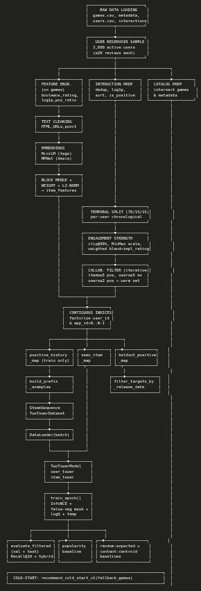
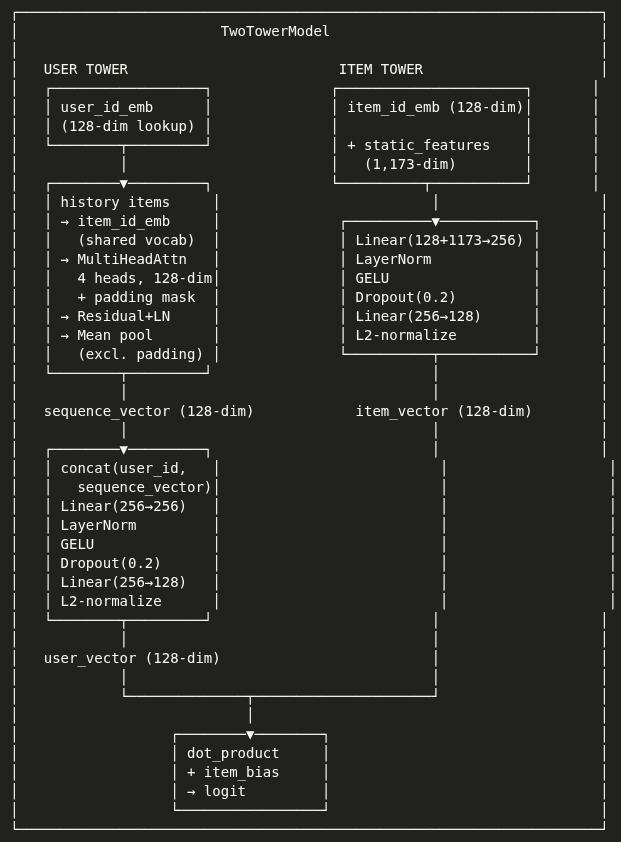

# v1 — Two-Tower Game Recommender

v1 is the second iteration of a game recommendation system that learns dense vector
representations (embeddings) for users and games using a two-tower neural architecture,
then retrieves recommendations via exact nearest-neighbor search.

## Quick Start

### Prerequisites
- Python ≥ 3.10
- PyTorch, SentenceTransformers, pandas, numpy, scikit-learn, tqdm
- A Kaggle account with API access (for downloading the dataset)

### Run via CLI

```bash
# 1. Download the Steam Games Recommendations dataset
bash v1/remote_data.sh

# 2. Run the full pipeline (data → features → train → evaluate)
python -m v1.src.main --stage full --ablation no_user_id
```

### Run via Notebook

```bash
jupyter notebook v1/notebooks/v1_modular.ipynb
```

The notebook mirrors the CLI pipeline cell-by-cell. Set the `ABLATION` variable in
the config cell to choose a variant (`full`, `no_popularity`, `no_user_id`, `mean_pool`).

---

## Why v1 Exists

**The core problem:** v0 used TF-IDF + SVD for item representations and mean-pooling
over interacted items for user representations. This works, but there is no way for the
model to *learn* the semantic connection between a user's behaviour (driven by mood and
interests) and the items they interact with. Items were represented purely by the words
in their descriptions, decomposed into dense vectors — no deep connections were learned.

v1 solves this with three design goals:

1. **Learned embeddings** — both items and users get dense vectors produced by a
   trainable neural architecture, not static TF-IDF decomposition.
2. **Embedding persistence** — model weights are saved as PyTorch checkpoints (`.pt`)
   so inference can run without re-training; item embeddings are generated
   in-memory at evaluation time.
3. **ANN retrieval** — approximate nearest-neighbor search over the full catalog for
   scaled retrieval efficiency (planned for v2).

> **What v1 delivers now:** goal 1 and the foundation for goals 2 and 3. The two-tower
> model is trained, full-catalog evaluation runs via exact dot-product scoring (matrix
> multiplication in PyTorch — fast enough for the ~2.5K warm item catalog), and model
> checkpoints are saved for reuse. Standalone FAISS index persistence and ANN serving
> are deferred to v2.

---

## The Pipeline

But before the architecture, how does the data even get there? The data comes from
an offline Kaggle dataset — the Steam Games Recommendations dataset — containing
games, user reviews, and metadata (tags, descriptions, ratings). It is cleaned,
features are engineered, and the result is fed through a multi-stage pipeline.

**Stage 1 — Data ingestion.** Raw CSVs and JSON are loaded, then 3,000 active users
(≥20 reviews each) are reservoir-sampled to keep memory tractable. Only their
interactions are loaded.

**Stage 2 — Feature engineering.** Games metadata is transformed into a 1,173-dim
feature vector per item: structured metadata (price, platform booleans, rating
one-hots), tag embeddings from MiniLM (384-dim), and description+title embeddings
from MPNet (768-dim). Each block is L2-normalized independently, weighted, and
concatenated into the final item feature matrix.

**Stage 3 — Temporal splitting.** Interactions are split per-user chronologically
(70% train, 15% val, 15% test). This is critical: the model trains on the past and
evaluates on the future. No random splitting — that would leak future data.

**Stage 4 — Warm catalog stabilization.** Not all items have enough signal for
collaborative learning. Iterative cross-filtering prunes items with <5 positive
train interactions and users with <5 events or <2 positives. The catalog shrinks
from ~15K items to ~2.5K warm items.

**Stage 5 — Dataset construction.** User and item IDs are remapped to contiguous
0..N−1 indices for embedding table lookups. Prefix training examples are built via
a sliding window over each user's positive history — the model learns to recommend
given *any prefix*, making it robust to users with few interactions. History
sequences are right-padded to 50 and wrapped in a PyTorch Dataset.

**Stage 6 — Training.** The two-tower model trains with in-batch InfoNCE
(contrastive loss), false-negative masking, LogQ popularity correction, and a
learnable temperature. AdamW + ReduceLROnPlateau + early stopping. The best
checkpoint is selected by validation Recall@10, not loss.

**Stage 7 — Evaluation.** Every user is scored against the entire warm catalog in
one matrix multiplication. Results are filtered per-user: already-seen items and
not-yet-released items are excluded. Metrics: HitRate@10, Precision@10, Recall@10.

Here's the complete flow:



---

## Architecture

At the centre of all this is a **Two-Tower Model** — the industry-standard
architecture for candidate generation in recommendation systems.



**User Tower:** encodes a user's interaction history through multi-head
self-attention (4 heads, 128-dim), combined with a learnable user ID embedding,
producing a 128-dim user vector. The attention mechanism captures pairwise
relationships between items in the user's history — "this user likes indie RPGs."

**Item Tower:** encodes each game by concatenating a learnable item ID embedding
with the 1,173 static features, projecting through two linear layers with GELU
and dropout, producing a 128-dim item vector.

Both vectors live in the same L2-normalized space where dot product equals cosine
similarity. Training uses InfoNCE with false-negative masking (known positives
appearing as in-batch negatives are masked out) and LogQ correction (compensates
for popular items being over-represented as in-batch negatives). The temperature
is a learnable parameter — the model discovers its own optimal sharpness.

At evaluation, all item embeddings are precomputed via one forward pass and
scored against each user vector in a single matrix multiplication — exact
nearest-neighbor retrieval over the warm catalog.

---

## Baselines

Now, you must be wondering: is the model actually any good? To answer that, we
need something to compare against. v1 has three baselines:

1. **Random expected** — analytical expected value of random recommendation
   (hypergeometric distribution). This is the statistical floor.

2. **Popularity** — recommend the most-interacted items in the training set.
   Non-personalized, but if the model can't beat "just recommend the popular
   stuff," it hasn't learned anything useful.

3. **Content centroid** — average the feature vectors of a user's training items,
   then recommend the closest items by cosine similarity. This is essentially
   what v0 did. If content alone suffices, why learn?

To put things in perspective: the two-tower model beats all three baselines by
a wide margin. The best configuration (no_user_id) achieves more than 2× the
recall of the strongest baseline (popularity).

---

## Ablations

After v1 was working, we asked: what actually helps and what doesn't? Four
controlled experiments isolate each major component:

| Variant | What changes | Question answered |
|---|---|---|
| `full` | All components active | Baseline |
| `no_popularity` | HYBRID_ALPHA = 0 — no popularity blend at inference | How much recall comes from personalization vs heuristic? |
| `no_user_id` | Removes user_id_embedding from user tower | Is the model generalizing or memorizing user identity? |
| `mean_pool` | Replaces self-attention with simple averaging | Does attention earn its keep at this scale? |

**`no_user_id` is the best configuration.** Removing the per-user embedding
forces the model to generalize from history alone — and it performs *better*
(+19.8% test recall over full). Strong evidence the full model was overfitting
to warm-user identity at this scale.

**Attention matters.** Mean pooling drops recall by ~20%, confirming multi-head
self-attention earns its keep — pairwise item relationships in user histories
are meaningful even at ~2.5K items.

**Popularity blend helps at α=0.2.** A sweep found α=0.2 is optimal — the blend
provides meaningful signal without drowning out personalization.

Full details: [ABLATIONS.md](ABLATIONS.md).

---

## Cold Start

What about items that were filtered out during warm-catalog stabilization —
items with too few interactions to learn a collaborative embedding? They're
still in the fallback catalog. `cold_start.py` ranks them by a weighted blend
of popularity (60%), positive ratio (25%), and review count (15%) — metadata
signals that require no interaction history. New items stay discoverable.

---

## Results

| Method | Test Recall@10 | Test HitRate@10 |
|---|---|---|
| **v1 (no_user_id)** | **0.0812** | **0.1973** |
| v1 (full) | 0.0678 | 0.1699 |
| Popularity baseline | 0.0395 | — |
| Content centroid baseline | 0.0318 | — |
| Random expected | 0.0050 | — |

The best learned model is >2× better than the strongest non-personalized
baseline. See [ABLATIONS.md](ABLATIONS.md) for the full breakdown including
validation metrics, per-ablation baselines, and the HYBRID_ALPHA sweep.

---

## Project Structure

```
v1/
├── src/                    # 13 Python modules (modular pipeline)
│   ├── config.py           # Constants, paths, seeds, hyperparameters
│   ├── loaders.py          # Raw data loading + user reservoir sampling
│   ├── preprocessing.py    # Cleaning, labeling, catalog intersection
│   ├── features.py         # Item feature engineering (1,173-dim vectors)
│   ├── splitting.py        # Temporal split + warm-catalog filtering
│   ├── dataset.py          # Indexing, prefix examples, PyTorch Dataset
│   ├── model.py            # TwoTowerModel (user/item towers)
│   ├── training.py         # InfoNCE training loop + early stopping
│   ├── evaluation.py       # Full-catalog retrieval evaluation
│   ├── baselines.py        # Random, popularity, content-centroid baselines
│   ├── cold_start.py       # Cold-start fallback for items with no history
│   ├── pipeline.py         # Stage orchestration
│   └── main.py             # CLI entry point (argparse)
├── notebooks/
│   ├── v1_modular.ipynb    # Modular notebook (mirrors src/)
│   └── experimental/
│       └── v1.ipynb        # Original experimental notebook (historical reference)
├── remote_data.sh          # Downloads the Kaggle dataset
├── PIPELINE.md             # Complete data-flow and design reference
└── ABLATIONS.md            # Ablation study results and analysis
```

Images referenced above (`image.png`, `image-1.png`) live at `../images/` in the repository root.

---

## Further Reading

- **[PIPELINE.md](PIPELINE.md)** — complete data-flow reference: every function,
  concept, and design decision, organized by pipeline stage.
- **[ABLATIONS.md](ABLATIONS.md)** — full ablation study: what each component
  contributes, results tables, and analysis.
